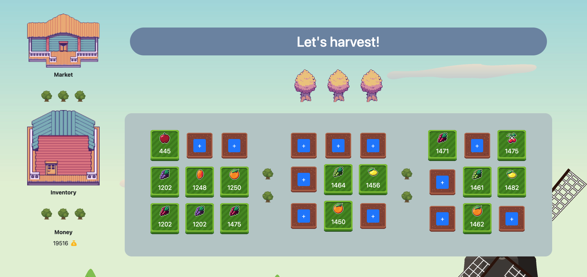

[](https://classroom.github.com/online_ide?assignment_repo_id=7549573&assignment_repo_type=AssignmentRepo)
# Harvesting Fruits Game
Link: https://nic-brian-org.github.io/project-ducphattran/

## Introduction
This is a simple game where the user harvests the fruits by clicking on the green land. On the other hand, the user clicks the plus button to plant a seed. After being planted, the harvestable amount will increase after a fixed time. 
In addition, the user can sell the fruits in the market to earn money.

<br>

<br>

This game is made with plain Javascript. In addition, it uses other libraries to polish the UI:

- [Bootstrap v4](https://getbootstrap.com/docs/4.6/layout/overview/)
- [Font Awesome v6](https://fontawesome.com/)

## Classes
The game contains two main objects: **Fruit** and **Land**. 
### Land (id, status, fruitId, harvestableAmount)
Land is used to plant and  harvest the fruit, it contains two statuses:

- 0: Not planted
- 1: Planted

The harvest only occurs if the status is 1 and the ```harvestableAmount``` is greater than 0.

Land has 3 functions:
- harvest()

This function changes the status from 1 to 0 and resets the ```harvestableAmount```.

- plant(_fruitId)

This function changes the status from 0 to 1 and sets ```fruitId``` to the new value (```_fruitId```).

- row(amountToGrow)
This function increases the ```harvestableAmount``` with a given value (```amountToGrow```).

<br>

### Fruit (id, name, price, quantity, imageSrc)
This class contains information to display fruit in the **Market** and **Inventory**.

It has 2 functions:

- increaseQuantity(_increment)

This function increases the current ```quantity``` with a given value (```_increment```)

- decreaseQuantity(_decrement)

This function decreases the current ```quantity``` with a given value (```_decrement```)

## Files
Filename | Description
--- | --- |
app.js | Initialize data
constant.js | Contain global variables
data.js | Contain mock-up data (used for first attempt)
Fruit.js | Fruit Class
Land.js | Land Class
helper.js | Contain all the generating HTML elements and the logic functions
render.js | Contain rendering functions after the data is set

<br>

## Code Description
The game does not show any land or fruit by default. Fruits and Lands are rendered by Javascript code. In particular, I define each square of land as a "land box." Each of them has two states: plant and unplanted. If the state is planted, it will display the fruit image and the harvestable amount. Otherwise, it will display a plus button that opens a new modal to select a seed to plant. When the land is planted and the amount is greater than 0, the user can harvest it by clicking on it. It will change to land with a plus button. In addition, the planted land starts growing by 1 every 2 seconds. 

The Inventory has the same modal element as the plus button. However, based on what the user clicks, it will display differently. In addition, the modal elements which contain fruits will re-render if any harvest or sale is made to update the quantity. 

In addition, the game stores and gets data from the local storage. The mock-up data (data.js) will be uses as the initial data for the first attempt.

<br>

## References (Game assets)
* https://bakudas.itch.io/generic-oldwest-pack
* https://helm3t.itch.io/farmlandia-fruit
* https://aztrakatze.itch.io/topdown-farm-crop
